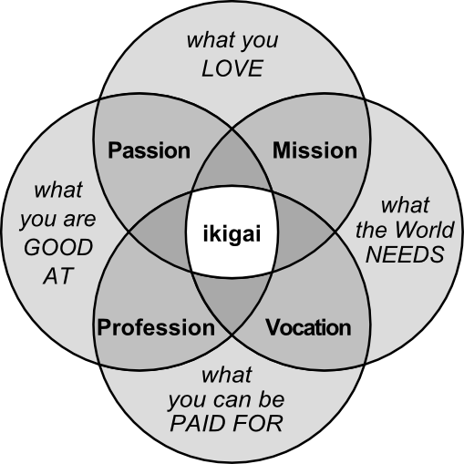

# Introduction to IKIGAI


Ikigai (生き甲斐) is a Japanese concept that translates to "reason for being." It represents the intersection of four fundamental elements: what you love, what you are good at, what the world needs, and what you can be paid for. Discovering your Ikigai is believed to bring fulfillment, happiness, and a sense of purpose to your life.

# Ikigai Compass
Ikigai Compass is designed to guide users on their journey to discovering their Ikigai. By providing an interactive assessment, personalized analysis, and AI-driven chat support, the application helps users explore their passions, skills, and purpose, ultimately leading to a more balanced and fulfilling life.

## Features

- **Ikigai Assessment**: Answer key questions to explore your passions, skills, and purpose.
- **Personalized Analysis**: Receive actionable insights based on your responses.
- **AI Chat Assistant**: Engage with an AI guide to explore deeper insights and receive support.
- **Vector Store Integration**: Store and retrieve user data for personalized interactions.

## Installation

1. **Clone the Repository**
   ```bash
   git clone https://github.com/harshil-pansuriya/ikigai-compass.git
   cd ikigai-compass
   ```

2. **Set Up Virtual Environment**
   ```bash
   python -m venv venv
   source venv/bin/activate  
   ```

3. **Install Dependencies**
   ```bash
   pip install -r requirements.txt
   ```

4. **Environment Variables**
   - Create a `.env` file in the root directory.
   - Add your API keys and other environment variables:
     ```
     GROQ_API_KEY=your_groq_api_key
     ```

5. **Run the Application**
   ```bash
   streamlit run home.py
   ```

## Usage

- **Home Page**: Learn about the concept of Ikigai and start your journey.
- **Assessment Page**: Answer questions to receive a personalized Ikigai analysis.
- **Chatbot Page**: Interact with the AI assistant for further guidance and support.

## Project Structure

- `home.py`: Main entry point for the application.
- `pages/`: Contains additional Streamlit pages like `chatbot.py` and `assessment.py`.
- `utils/`: Utility modules for vector store management, RAG chain creation, and prompt templates.
- `assets/`: Contains static assets like images.

## Dependencies
- streamlit
- python-dotenv
- langchain
- langchain-groq
- chromadb
- sentence-transformers

## License

This project is licensed under the MIT License. See the [LICENSE](LICENSE) file for details.
